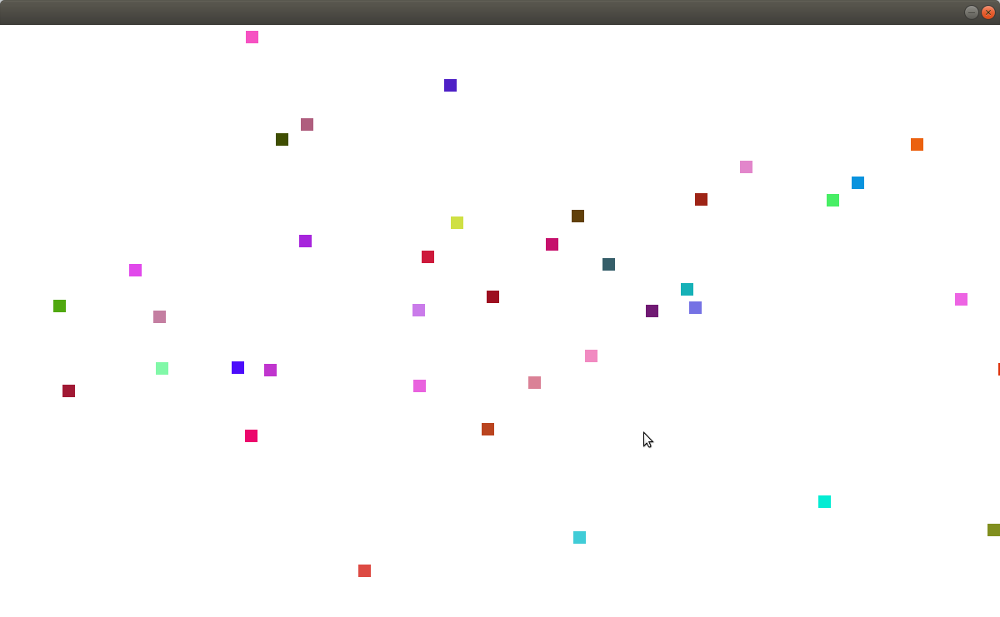

# Collision Game

This is a collision game, where each boxes collide and move in different directions.

# Trending-Repos

## Built With

- Ruby
- Ruby2d

## Screenshot

## Getting Started

To get a local copy up and running follow these simple example steps.

- Clone the repo by typing `git@github.com:keneogu/Collision-Game.git`
- `gem install ruby2d` - To install ruby2d

## Run 

- Go to your terminal
- Run `ruby collision.rb`

## Author

👤 **Kenechukwu Oguagbaka**

- GitHub: [@keneogu](https://github.com/keneogu)
- Twitter: [@keneogu](https://twitter.com/keneogu)
- LinkedIn: [@keneogu](https://www.linkedin.com/in/oguagbaka-kenechukwu-8b2289179/)

## 🤝 Contributing

Contributions, issues, and feature requests are welcome!

## Show your support

Give a ⭐️ if you like this project!